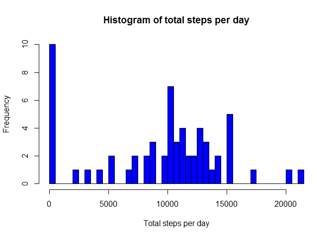
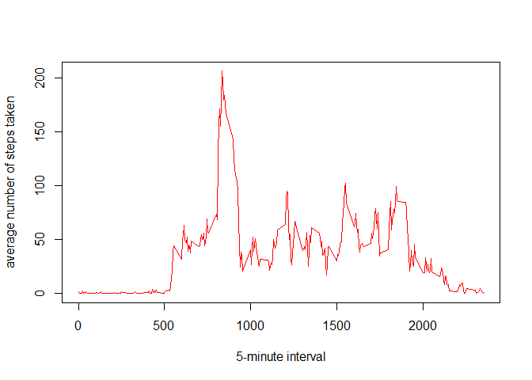
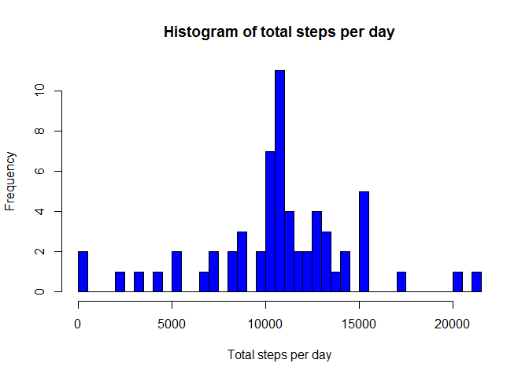
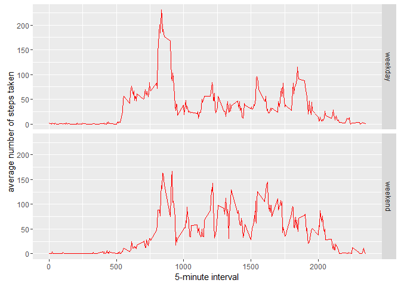

# Reproducible Research: Peer Assessment 1


## Loading and preprocessing the data

```r
data <- read.csv("activity.csv")
```


## What is mean total number of steps taken per day?

```r
stepsperday <- tapply(data$steps, data$date, sum, na.rm=TRUE)
hist(stepsperday, col="blue", breaks=50, xlab="Total steps per day", main="Histogram of total steps per day")
```



```r
## mean and median of the total number of steps taken per day
mean(stepsperday, na.rm=TRUE)
```

```
## [1] 9354.23
```

```r
median(stepsperday, na.rm=TRUE)
```

```
## [1] 10395
```


## What is the average daily activity pattern?

```r
meandata <- aggregate(data$steps, by=list(data$interval), mean, na.rm=TRUE)
names(meandata) <- c("interval", "steps")
plot(meandata, type="l", col="red", xlab="5-minute interval", ylab="average number of steps taken")
```



```r
## 5-minute interval on average across all the days in the dataset containing the maximum number of steps
meandata[which.max(meandata$steps),]
```

```
##     interval    steps
## 104      835 206.1698
```


## Imputing missing values

```r
## number of missing values in the dataset
sum(is.na(data$steps))
```

```
## [1] 2304
```

```r
fill <- function(steps, interval) {
  filled <- NA
  if (!is.na(steps)) 
    filled <- c(steps) 
  else 
    filled <- (meandata[meandata$interval == interval, "steps"])
  return(filled)
}
nomiss_data <- data
nomiss_data$steps <- mapply(fill, nomiss_data$steps, nomiss_data$interval)

totalstepsperday <- tapply(nomiss_data$steps, nomiss_data$date, sum, na.rm=TRUE)
hist(totalstepsperday, col="blue", breaks=50, xlab="Total steps per day", main="Histogram of total steps per day")
```



```r
##  mean and median total number of steps taken per day
mean(totalstepsperday)
```

```
## [1] 10766.19
```

```r
median(totalstepsperday)
```

```
## [1] 10766.19
```
Mean and median values are higher after imputing missing data.

## Are there differences in activity patterns between weekdays and weekends?

```r
days <- function(date){
  day <- weekdays(date)
  if (day %in% c("Monday", "Tuesday", "Wednesday", "Thursday", "Friday"))
    return ("weekday")
  else if (day %in% c("Saturday", "Sunday"))
    return ("weekend")
}
nomiss_data$date <- as.Date(nomiss_data$date)
nomiss_data$day <- sapply(nomiss_data$date, days)

nomiss_mean <- aggregate(steps ~ interval + day, data = nomiss_data, mean)
library(ggplot2)
ggplot(nomiss_mean, aes(interval, steps)) + geom_line(colour="red") + facet_grid(day ~ .) + xlab("5-minute interval") + ylab("average number of steps taken")
```


